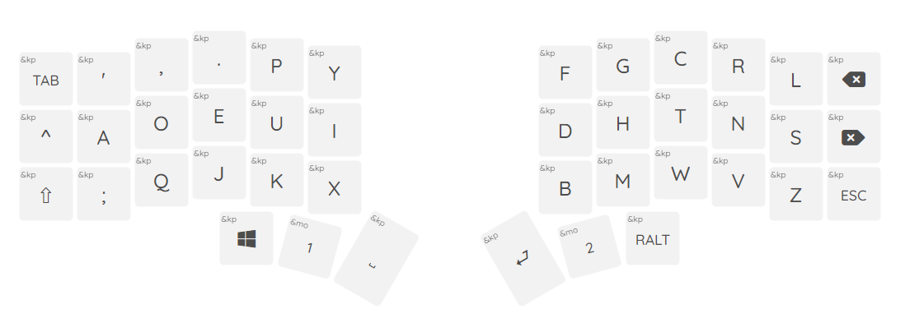
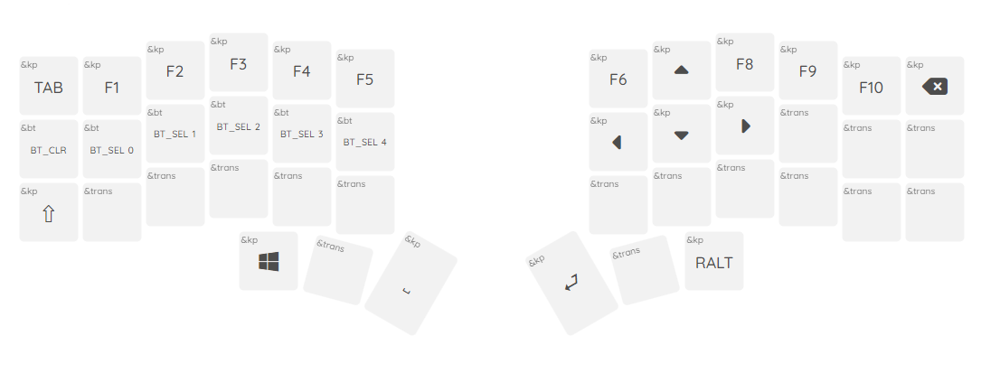

# Joshua Markle's ZMK Keymap ⌨

This is my personal [ZMK firmware](https://github.com/zmkfirmware/zmk/) configuration for my [Corne Keyboard](https://github.com/foostan/crkbd). I have also created a [Build Guide](doc/Build-Guide.md) specifically for my wireless Corne Cherry.

Eveything is talored around the DVORAK keyboard layout and optimized for programmers!

### Default Layer
c

### Lower Layer

### Upper Layer

## Helpful Sources

- Visualizations made with [nickcoutsos/keymap-editor](https://github.com/nickcoutsos/keymap-editor)

#### Keymapping

- [Designing a Symbol Layer by Pascal Getreuer](https://getreuer.info/posts/keyboards/symbol-layer/index.html)
- [DreymaR's Big Bag of KBD Tricks](https://dreymar.colemak.org/layers-main.html)