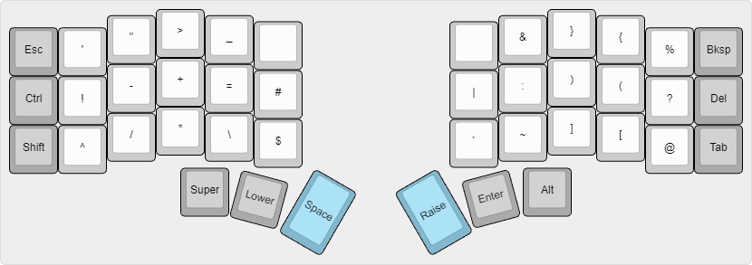
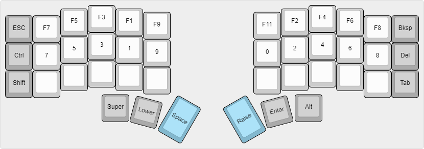

# Joshua Markle's ZMK Keymap ⌨

This is my personal [ZMK firmware](https://github.com/zmkfirmware/zmk/) configuration for a [Corne Keyboard](https://github.com/foostan/crkbd). All design choices are talored for programmers using the DOVARK layout!

## The Keymap

#### Base Layer

#### Symbol Layer (Upper)

#### Functional Layer (Lower)

All visualizations were created on [keyboard-layout-editor.com](http://www.keyboard-layout-editor.com/)

Raw Data

 Normal Layer
  
<pre>
[{x:3,a:7},".",{x:7},"C"],
[{y:-0.875,x:2},",",{x:1},"P",{x:5},"G",{x:1},"R"],
[{y:-0.875,x:5},"Y",{x:3},"F"],
[{y:-0.875,c:"#aaaaaa"},"Esc",{c:"#cccccc"},"'",{x:11},"L",{c:"#aaaaaa"},"Bksp",{c:"#cccccc"}],
[{y:-0.375,x:3},"E",{x:7},"T"],
[{y:-0.875,x:2},"O",{x:1},"U",{x:5},"H",{x:1},"N"],
[{y:-0.875,x:5},"I",{x:3},"D"],
[{y:-0.875,c:"#aaaaaa"},"Ctrl",{c:"#cccccc"},"A",{x:11},"S",{c:"#aaaaaa"},"Del",{c:"#cccccc"}],
[{y:-0.375,x:3},"J",{x:7},"W"],
[{y:-0.875,x:2,a:7},"Q",{x:1},"K",{x:5},"M",{x:1},"V"],
[{y:-0.875,x:5,a:7},"X",{x:3},"B"],
[{y:-0.875,c:"#aaaaaa"},"Shift",{c:"#cccccc"},";",{x:11},"Z",{c:"#aaaaaa"},"Tab"],
 [{rx:3.5,ry:4.25,y:-1},"Super"],
[{rx:10.5,y:-1},"Alt"],
[{r:15,rx:4.5,y:-1},"Lower"],
[{r:30,rx:5.75,ry:4.125,y:-1,h:1.5,c:"#83B8CE"},"Space"],
[{r:-30,rx:8.375,ry:4.625,y:-1,h:1.5},"Raise"],
[{r:-15,rx:9.5,ry:4.5,y:-1,c:"#aaaaaa"},"Enter"]
</pre>
 Symbol Layer
  
<pre>
[{x:3,a:7},">",{x:7},"}"],
[{y:-0.875,x:2},"\"",{x:1},"_",{x:5},"&",{x:1},"{"],
[{y:-0.875,x:5},"",{x:3},""],
[{y:-0.875,c:"#aaaaaa"},"Esc",{c:"#cccccc"},"'",{x:11},"%",{c:"#aaaaaa"},"Bksp",{c:"#cccccc"}],
[{y:-0.375,x:3},"+",{x:7},")"],
[{y:-0.875,x:2},"?",{x:1},"=",{x:5},":",{x:1},"("],
[{y:-0.875,x:5},"#",{x:3},"|"],
[{y:-0.875,c:"#aaaaaa"},"Ctrl",{c:"#cccccc"},"!",{x:11},"?",{c:"#aaaaaa"},"Del",{c:"#cccccc"}],
[{y:-0.375,x:3},"=",{x:7},"]"],
[{y:-0.875,x:2,a:7},"/",{x:1},"\\",{x:5},"",{x:1},"["],
[{y:-0.875,x:5,a:7},"$",{x:3},"~"],
[{y:-0.875,c:"#aaaaaa"},"Shift",{c:"#cccccc"},"^",{x:11},"@",{c:"#aaaaaa"},"Tab"],
 [{rx:3.5,ry:4.25,y:-1},"Super"],
[{rx:10.5,y:-1},"Alt"],
[{r:15,rx:4.5,y:-1},"Lower"],
[{r:30,rx:5.75,ry:4.125,y:-1,h:1.5,c:"#83B8CE"},"Space"],
[{r:-30,rx:8.375,ry:4.625,y:-1,h:1.5},"Raise"],
[{r:-15,rx:9.5,ry:4.5,y:-1,c:"#aaaaaa"},"Enter"]
</pre>
 Functional Layer
  
<pre>
[{x:3,a:7},">",{x:7},"}"],
[{y:-0.875,x:2},"\"",{x:1},"_",{x:5},"&",{x:1},"{"],
[{y:-0.875,x:5},"",{x:3},""],
[{y:-0.875,c:"#aaaaaa"},"Esc",{c:"#cccccc"},"'",{x:11},"%",{c:"#aaaaaa"},"Bksp",{c:"#cccccc"}],
[{y:-0.375,x:3},"+",{x:7},")"],
[{y:-0.875,x:2},"?",{x:1},"=",{x:5},":",{x:1},"("],
[{y:-0.875,x:5},"#",{x:3},"|"],
[{y:-0.875,c:"#aaaaaa"},"Ctrl",{c:"#cccccc"},"!",{x:11},"?",{c:"#aaaaaa"},"Del",{c:"#cccccc"}],
[{y:-0.375,x:3},"=",{x:7},"]"],
[{y:-0.875,x:2,a:7},"/",{x:1},"\\",{x:5},"",{x:1},"["],
[{y:-0.875,x:5,a:7},"$",{x:3},"~"],
[{y:-0.875,c:"#aaaaaa"},"Shift",{c:"#cccccc"},"^",{x:11},"@",{c:"#aaaaaa"},"Tab"],
 [{rx:3.5,ry:4.25,y:-1},"Super"],
[{rx:10.5,y:-1},"Alt"],
[{r:15,rx:4.5,y:-1},"Lower"],
[{r:30,rx:5.75,ry:4.125,y:-1,h:1.5,c:"#83B8CE"},"Space"],
[{r:-30,rx:8.375,ry:4.625,y:-1,h:1.5},"Raise"],
[{r:-15,rx:9.5,ry:4.5,y:-1,c:"#aaaaaa"},"Enter"]
</pre>
 [{rx:3.5,ry:4.25,y:-1},"Super"],
[{rx:10.5,y:-1},"Alt"],
[{r:15,rx:4.5,y:-1},"Lower"],
[{r:30,rx:5.75,ry:4.125,y:-1,h:1.5,c:"#83B8CE"},"Space"],
[{r:-30,rx:8.375,ry:4.625,y:-1,h:1.5},"Raise"],
[{r:-15,rx:9.5,ry:4.5,y:-1,c:"#aaaaaa"},"Enter"]
</pre>

#### Keymapping

- [Designing a Symbol Layer by Pascal Getreuer](https://getreuer.info/posts/keyboards/symbol-layer/index.html)
- [DreymaR's Big Bag of KBD Tricks](https://dreymar.colemak.org/layers-main.html)

I have also created a [Build Guide](doc/Build-Guide.md) specifically for my wireless Corne Cherry!