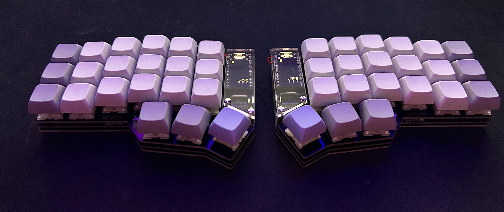

# Wireless Corne MX Build Guide 📄

This guide provides step-by-step instructions for how I built my personal keyboard with the supplies availiable to me. Overall, the entire process took around 2 dedicated days of researching and soldering to put together a complete keyboard (minus the LEDs). This range of time will fluctuate based on the amount of experience you have and your comfortability with soldering.

### All The Parts 🛒

- Cherry Corne kit
    - PCB (Left & Right)
    - 2 NiceNano v2
    - 42 Kailh Hotswap Sockets (MX)
    - 42 Diodes
    - 2 Reset Buttons
    - (Suggested) 2 On/Off Switches
    - (Optional) 42 SK6812MINI-E 3228 LEDs
    - (Optional) 12 WS2812B-5050 LEDs
- Soldering equiptment
- Key Switches and Keycaps
- (Optional) Tweezers
- Alot of time

## Build Process 🔧

⚠️ Before I start, I have to say that it is not my fault if you break anything. If you are not comfortable with any of this, it might be best to just spend the extra money for someone to do it for you. Now that's out of the way, lets start!

### Temperature Stuff 🔥

Many guides out there recommend soldering at a low temperature, somewhere around ~300 degrees, to prevent damaging the PCB or micro controller. This is good advice but it is more important that you aren't in contant with any compontent for too long. I say this beacuese not all soldering wires will allow such low temperatures so each situation will be different. I recommend soldering at the lowest temp you can where the solder will flow but be very careful how long you are in contact with any component.

### PCB First ⚡

⚠️ For this section, make sure to be on the backside of the board ⚠️

    

#### Diodes
There is no best place to start, but the diodes are a pretty good option. These little suckers are small and this is where having tweezers is helpful.

    

> ⚠️ Diodes only flow in one direction and must be placed in the **correct orientation**. You should line up the line on the diaode to the vertical line on the PCB that is being pointed to by an arrow.

I found that the best way to solder these guys on is to prime the connection point with some solder, hold the diaode in place, and then resolder, pushing the diaode into its correct spot.

#### Hotswap Sockets

Next is the hotswap sockets. These will be used to get the input from the key switches.
  

    

> ⚠️ Like the diaodes, the hotswap sockets also have a **certain orientation** indicated on the PCB. Just make sure that each one doesn't cover up the area that the keyswitch is supposed to fit.

In the end, it should look something like this:

    

#### LEDs

For the LEDs, I personally do not like the look of LEDs so I never actually soldered them on but I would assume a similar process to the diodes and hotswap sockets where the main concern is the correct orientation.

### Micro Controller Time 💻

For this guide, I will be using the [NiceNano v2](https://nicekeyboards.com/nice-nano/) so that my keyboard is wireless. 

⚠️⚠️⚠️ It is super important that you flip to the **top side of the PCB**. Soldering on the wrong side will cost you an absurb amount of time of desoldering and suffering.

#### Connecting The Battery 🔋

> If there is a way to connect a power switch to your board, definetly do that. I did not. This means that when I unplug my Corne from charging, it will stay on until it dies. This is not the best for the battery and I would have liked to be able to turn my keyboard off.

When connecting the battery, you will have to solder the black (negative) wire to the negative connection point on the nice nano (top right) and the red, positive, wire to the positive connection point on the nice nano (top left). 

> It is good practice to test the positive and negative wires with a multimeter or at least check with your supplier.
 

    

#### Making Hotswappable 💨

For my build, I used 2x 12 Pin Sockets and 24x Mill-Max Pins in order to make my microcontroller detachable from the PCB.

    

The 12 Pin Sockets are soldered onto the front side of the PCB first and then the pins are placed within each of the sockets. From there, a nice nano is placed ⚠️ **Face Down** ⚠️ and the pins fill every slot but the two top slots for the battery. After that, the tops of the pins are soldered to the nice nanos.

By seting everything up this way, the nice nanos can be removed from the Pin Sockets and swapped with a different microcontroller or even for troubleshooting.

#### Not Hotswappable? 💔

Thats fine, the nice nanos just have to be soldered **face down** onto the board with normal connectors. Make sure to leave some room for the battery to go underneath the nice nanos.

    

At this point, you should have something that looks a little like this:

    

The battery connected to the nice nano with a snug place to fit within the Corne.

### Installing Firmware (ZMK) 💾

The whole process is super well explained in the [ZMK documentation](https://zmk.dev/docs/user-setup) where you essentially: 

1. Create a GitHub repo
2. Run the setup script
3. Select your specific options
    - In my case: Corne and nice!nano v2
4. Download the firmware from GitHub Actions
5. Dragging the right and left uf2 files onto the nice nanos.

Customizing the ZMK keyboard layout is as simple as changing the keycodes within the corne.keymap file in the GitHub repo. It is also helpful to keep the comments that are initialized within the file to keep track of what keys are actually being mapped.

## Conclusion 😊

And that's it! Everything should be fully functional and working correctly.

## Troubleshooting 🔥

If you encounter any issues during the build process, refer to the troubleshooting section of the [Cherry Corne Build Guide](https://github.com/foostan/crkbd/blob/main/corne-cherry/doc/v3/buildguide_en.md).

Other useful places:

- [Marek Piechut's Corne MX Guide](https://reallifeprogramming.com/corne-mx-3-0-keyboard-build-guide-9b5c7eff4178)
